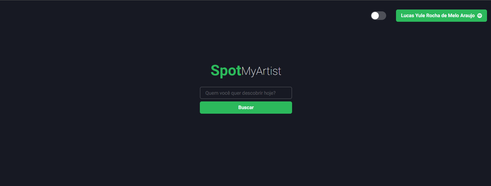

<div align="right">
 
</div>

<p align="center">
  
</p>

<p align="center"> 
  
  
  <a href="https://github.com/lucasyule2212">
    
  </a>
  
</p>

<p align="center">
 <a href="#eye_speech_bubble-preview">Preview</a> •
 <a href="#information_source-about">About</a> •
 <a href="#memo-tasks">Tasks</a> •
 <a href="#arrow_forward-run">Run</a> •
 <a href="#hammer_and_wrench-technologies">Technologies</a> •
 <a href="#muscle-contributors">Contributors</a> •
 <a href="#boy-author">Author</a> •
 <a href="#balance_scale-license">License</a>
</p>

---
## :eye_speech_bubble: **Preview**

<div align="center">

### :desktop_computer: Computer
  
|Desktop|
|:---:|
|<kbd></kbd>
  <kbd></kbd>
  <kbd></kbd>
  <kbd></kbd>
</div>
  
---
## :information_source: About

App developed for the "Introdução a Multimídia" class of 2021.2 of Computer Science bachelor degree. 

The intend was to develop a web application using and consuming the Spotify API to search and fetch data about Artists albums.

## :arrow_forward: **Run**

To run the project you need to clone or [`download`](https://github.com/lucasyule2212/SpotifyMultProject/spotify-mult-project) this repository, have the Node Package Manager ([`NPM`](https://www.npmjs.com/get-npm)) or the YARN Package Manager installed ([`YARN`](https://yarnpkg.com/getting-started)).

### :globe_with_meridians: **Web**

<details>
  <summary><i>with <b>npm</b></i></summary>
  
  ```bash
  # Install dependencies
  $ npm install

  # Start development server
  $ npm run dev
  ```
  
</details>

<details>
  <summary><i>with <b>yarn</b></i></summary>
  
  ```bash
  # Install dependencies
  $ yarn

  # Start development server
  $ yarn run dev

  ```

</details>

> ⚠️ The development server will start on port:3000 - Access <http://localhost:3000>


---
## :hammer_and_wrench: **Technologies**

The following tools is used to build this project:

<div align="center">

|:globe_with_meridians: Web|
|:---:|
|[NextJS](https://nextjs.org/)|
|[NextAuth](https://next-auth.js.org/)|
|[Axios](https://axios-http.com/ptbr/)|
|[Typescript](https://www.typescriptlang.org/)|
|[ChakraUI](https://chakra-ui.com/)|

</div>

## :boy: **Author**

<div align="center">

<a href="https://github.com/lucasyule2212">
 
 <br/>
 <sub><b>Lucas Yule</b></sub>
</a>

Developed with ❤️ by Lucas Yule 👋🏽 Contact me!

[](https://www.linkedin.com/in/AUTHORNAME)
[](https://github.com/AUTHORUSERNAME)
[](mailto:AUTHOREMAIL)

</div>

---
## :balance_scale: **License**

<div align="center">

Copyright © 2021 [NAME](https://github.com/lucasyule2212).<br />
This project is licensed by [MIT](./LICENSE).

</div>
